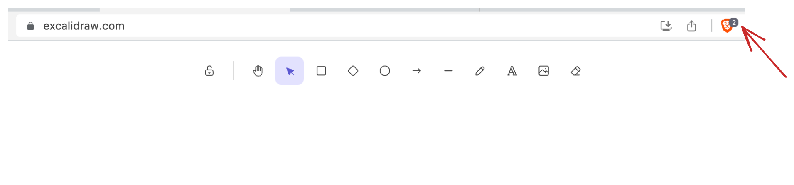
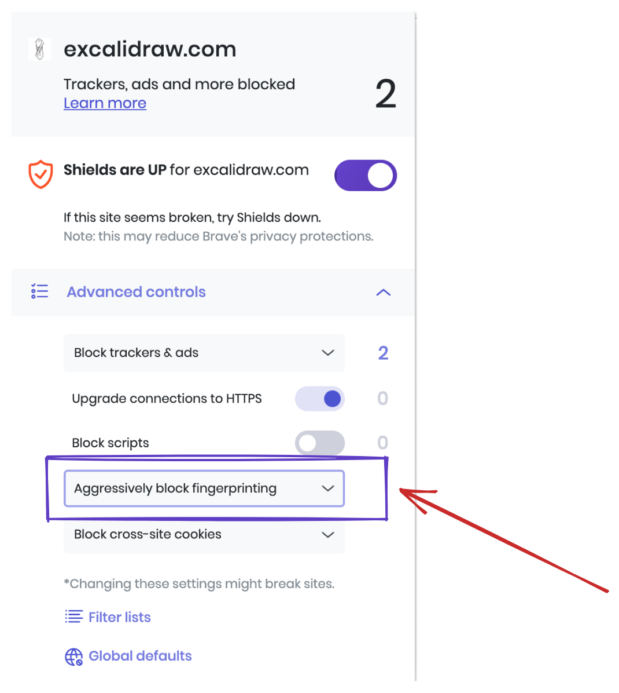
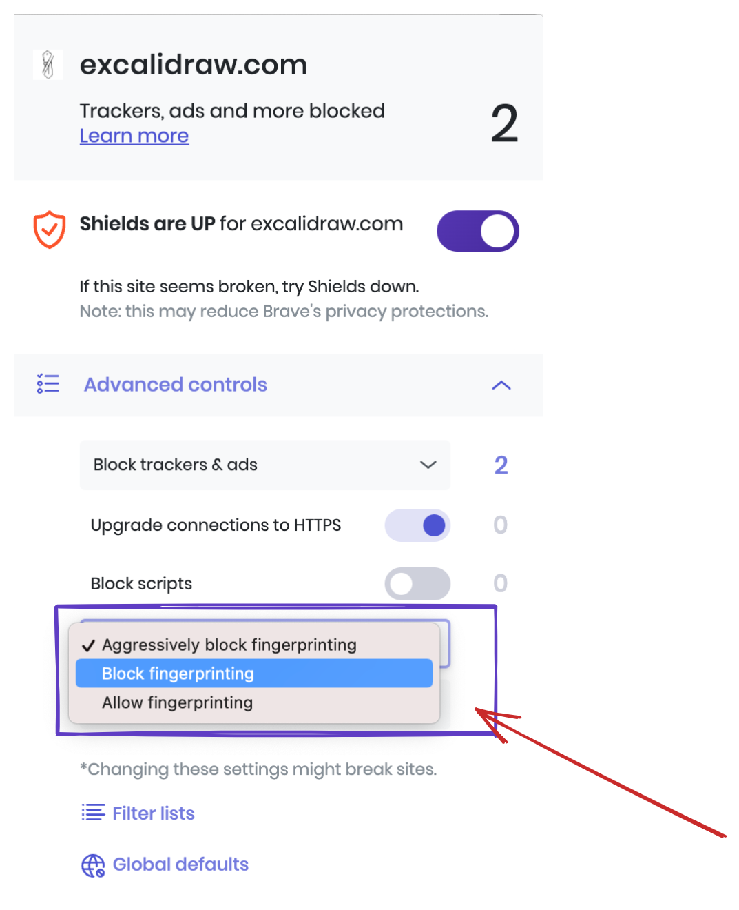

> 🌐 本文档由 [excalidraw/excalidraw](https://github.com/excalidraw/excalidraw) 翻译,英文原版见原项目。

# 常见问题(FAQ)

### 这个包支持协作功能吗?

不支持。Excalidraw 包本身不内置协作功能,因为协作的具体实现与每个宿主应用深度相关。我们对外暴露了一批 API,你可以通过它们与 Excalidraw 通信,自行实现协作能力。我们自己的实现可以看[这里](https://github.com/excalidraw/excalidraw/blob/master/excalidraw-app/index.tsx),关于如何实现同样功能还有一份[详细解答](https://github.com/excalidraw/excalidraw/discussions/3879#discussioncomment-1110524)。

### 在 Brave 浏览器中关闭"激进反指纹"(Aggressive Anti-Fingerprinting)

当 *Aggressive Anti-Fingerprinting* 开启时,`measureText` API 会失效,进而导致你绘图中的文本元素显示异常。更多信息见[这个 PR](https://github.com/excalidraw/excalidraw/pull/6336)。

我们强烈建议关闭该选项,操作步骤如下:


1. 在 Brave 中打开 [excalidraw.com](https://excalidraw.com),点击**盾牌(Shield)**按钮


<div style={{width:'30rem'}}>

2. 打开后,找到 **Aggressively Block Fingerprinting** 选项


3. 将其切换为 **Block Fingerprinting**(普通拦截)


4. 完事。所有文本元素应该都恢复正常了 🎉

</div>

如果关闭该设置后文本元素仍显示异常,请考虑在我们的 GitHub 上提交一个 [issue](https://github.com/excalidraw/excalidraw/issues/new),或者到 [Discord](https://discord.gg/UexuTaE) 上联系我们。


### ReferenceError: process is not defined

使用 `vite` 或其他构建工具时,你需要确保 `process` 对象可访问,因为我们要读取 `process.env.IS_PREACT` 来决定是否使用 `preact` 构建。

由于 Vite 默认会移除环境变量,你可以修改 vite 配置来保证它可用 :point_down:

```
 define: {
    "process.env.IS_PREACT": JSON.stringify("true"),
  },
```

## 需要帮助?

先看看已有的[问答区](https://github.com/excalidraw/excalidraw/discussions?discussions_q=label%3Apackage%3Aexcalidraw)。如果有任何疑问或需要帮助,可以[在这里](https://github.com/excalidraw/excalidraw/discussions?discussions_q=label%3Apackage%3Aexcalidraw)提问。
